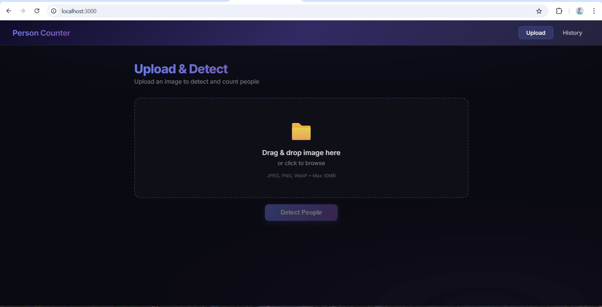
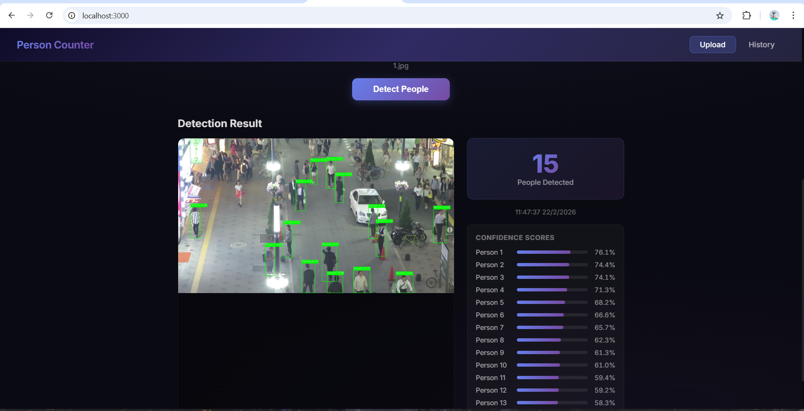
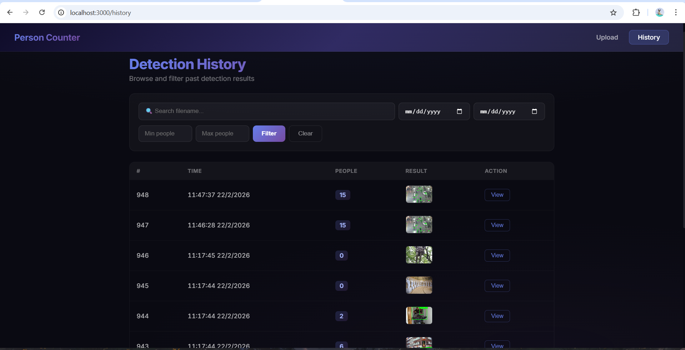

# Object Counter

Real-time pedestrian detection and counting system using YOLO + Triton Inference Server.

## Demo





## Tech Stack

| Layer | Technology |
|-------|-----------|
| **Frontend** | Next.js 14, TypeScript |
| **Backend API** | FastAPI (Python 3.11) |
| **ML Inference** | Triton Inference Server + YOLO26m (ONNX) |
| **Message Queue** | Apache Kafka |
| **Database** | PostgreSQL 16 |
| **Container** | Docker Compose |

## Architecture

```
Client ──► Next.js ──► FastAPI ──┬── POST /detect (sync)  ──► Triton ──► Response
                                 │
                                 └── POST /detect/async   ──► Kafka ──► Worker ──► Triton ──► DB
                                                                         │
                                                              GET /tasks/{id} ◄──┘
```

## Services

| Service | Port | Description |
|---------|------|-------------|
| `frontend` | 3000 | Next.js UI |
| `backend` | 8000 | FastAPI REST API |
| `triton` | 8001 | Triton gRPC inference |
| `kafka` | 9092 | Message broker |
| `zookeeper` | 2181 | Kafka coordination |
| `worker` | — | Kafka consumer (x2 replicas) |
| `db` | 5432 | PostgreSQL |

## Quick Start

```bash
# 1. Clone
git clone https://github.com/your-username/object_counter.git
cd object_counter

# 2. Place ONNX model
cp yolo26m.onnx backend/model_repository/pedestrian_detection/1/model.onnx

# 3. Run
docker-compose up -d --build

# 4. Open
# Frontend: http://localhost:3000
# API Docs: http://localhost:8000/docs
```

## API Endpoints

```
POST /api/detect          — Sync detection (upload → wait → result)
POST /api/detect/async    — Async detection via Kafka (returns task_id)
GET  /api/tasks/{task_id} — Check async task status
GET  /api/history         — Paginated detection history
GET  /health              — Health check
```

## Project Structure

```
object_counter/
├── backend/
│   ├── app/
│   │   ├── main.py              # FastAPI app + Kafka lifecycle
│   │   ├── config.py            # Settings (DB, Triton, Kafka)
│   │   ├── detector.py          # Triton client wrapper
│   │   ├── kafka_producer.py    # Async Kafka producer
│   │   ├── models.py            # SQLAlchemy models
│   │   ├── schemas.py           # Pydantic schemas
│   │   └── routes/
│   │       ├── detection.py     # /detect, /detect/async, /tasks
│   │       └── history.py       # /history
│   ├── worker.py                # Kafka consumer worker
│   ├── model_repository/        # Triton model config
│   └── scripts/
│       ├── batch_detect.py      # Batch inference script
│       └── export.ipynb         # YOLO → ONNX export
├── frontend/                    # Next.js app
├── docker-compose.yml
└── README.md
```